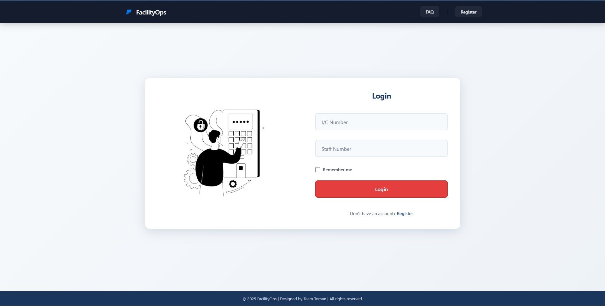
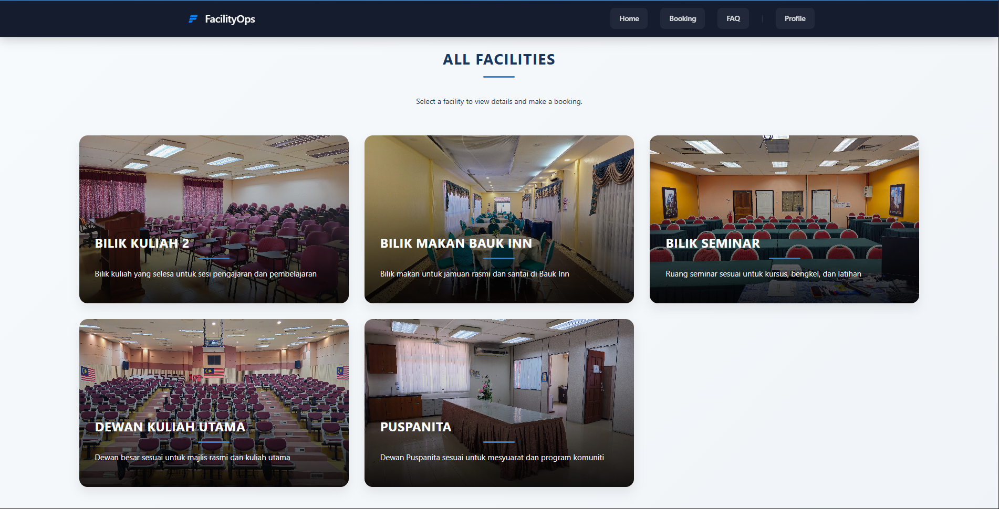
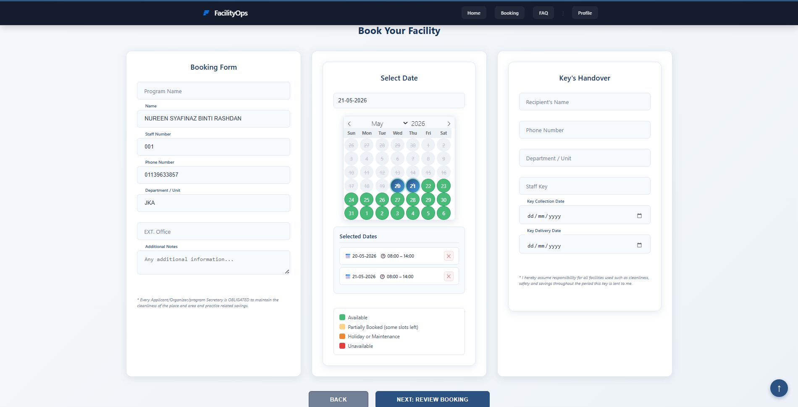
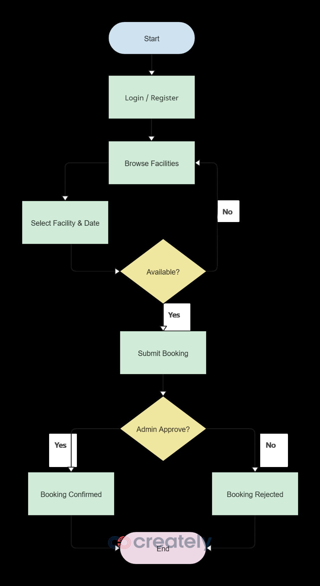
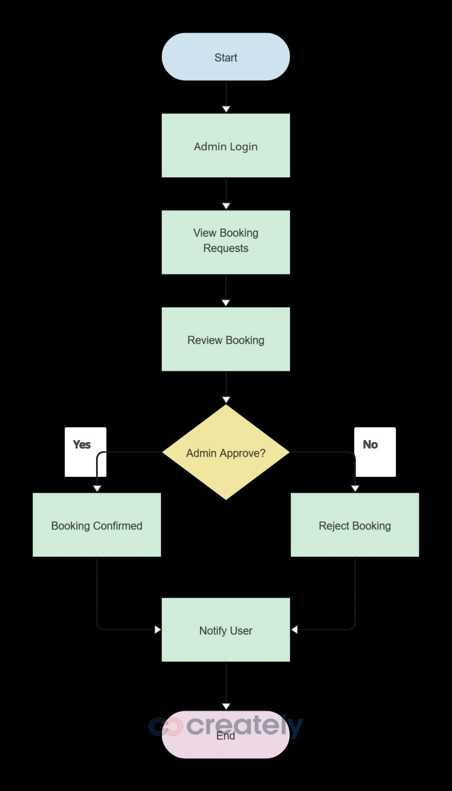
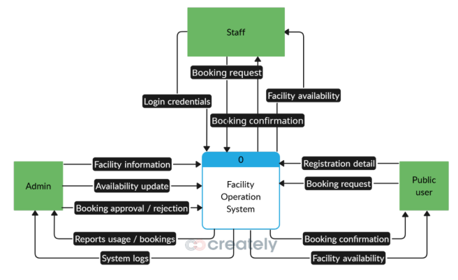
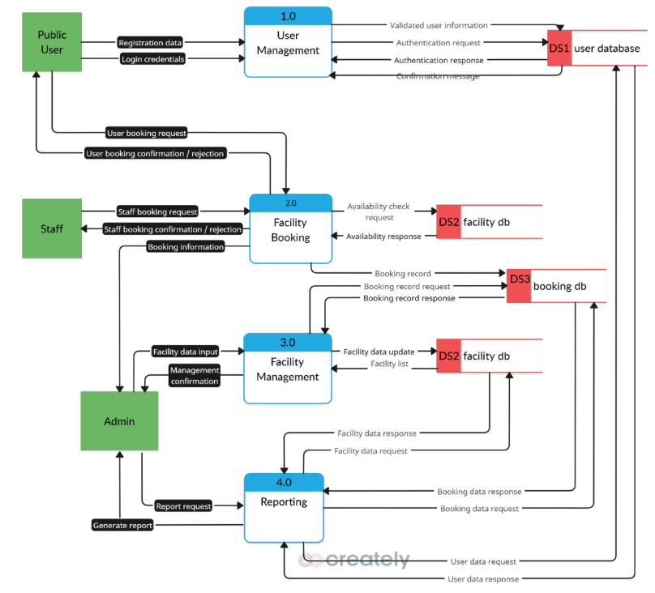
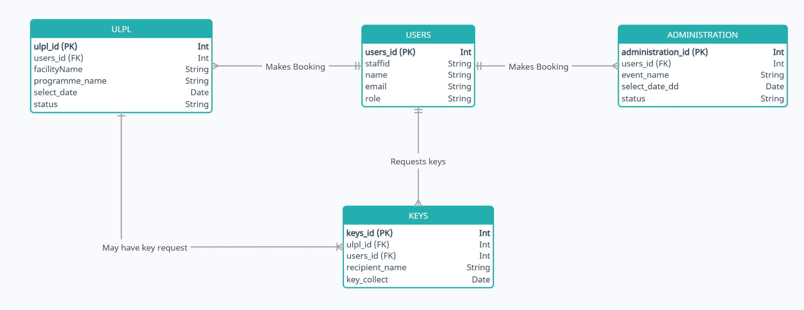
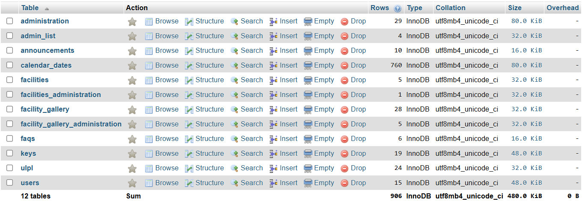

# Facility Operation System (FacilityOps)

A centralized web-based facility booking system developed for **Politeknik Sultan Mizan Zainal Abidin (PSMZA)**, built to replace manual, paper-based reservation processes for the **Unit Latihan & Pendidikan Lanjutan (ULPL)** and **Unit Pentadbiran**.

🔗 **Live Site:** [facilityops.org](https://facilityops.org/)

## Overview
At PSMZA, key facilities — Bilik Seminar, Dewan Kuliah Utama, Dewan Kuliah 2, Bilik Makan Bauk Inn, Puspanita (under ULPL), and Dewan Dagang (under Unit Pentadbiran) — were previously booked manually through the administrative office. This caused double bookings, scheduling conflicts, and wasted time.

**FacilityOps** digitalizes this process with real-time availability checking, online booking submission, automated approval workflows, and usage analytics — built using the **Agile development methodology**.

This is a **Final Year Project (FYP)** for the Diploma in Information Technology (Digital Technology), Department of ICT, PSMZA — Session I 2025/2026.

## Features

### For Staff / Public Users
- Secure login & self-registration
- Browse facilities with images and details
- Real-time availability calendar (🟢 available · 🟡 maintenance/holiday · 🔴 booked)
- Submit booking requests with key handover details
- Track booking status (approved / pending / rejected) via profile dashboard
- View, edit, or cancel bookings
- View booking history
- FAQ page with email & phone support

### For Administrators (ULPL & Unit Pentadbiran)
- Admin dashboard with booking statistics overview
- Approve/reject booking requests (single or batch)
- Manage facilities (add/edit/delete, images & descriptions)
- Calendar management (mark dates as available / unavailable / under maintenance)
- Manage announcements & FAQs
- Analytics report — booking trends, top active departments, status distribution (export as PDF/CSV)
- Role-based admin management (add/remove admin privileges)

## Technologies Used
| Category | Stack |
|---|---|
| Backend | PHP |
| Frontend | HTML, CSS, JavaScript |
| Database | MySQL |
| Local Server | XAMPP / WAMP |
| Editor | Visual Studio Code |
| Hosting | Hostinger |

## Project Structure
```
facilityops/
├── facilityops/          # Main application source code
├── docs/                 # System design diagrams (flowcharts, ERD, DFD, etc.)
├── booking1.png          # Screenshot - booking page
├── booking3.png          # Screenshot - booking page
├── login.png             # Screenshot - login page
├── README.md
└── ...
```

## Installation

1. **Clone this repository**
   ```bash
   git clone https://github.com/nvrnsya/facilityops.git
   ```

2. **Move the project folder into your server's root directory**
   - XAMPP: `C:/xampp/htdocs/facilityops`
   - WAMP: `C:/wamp64/www/facilityops`

3. **Start Apache and MySQL**
   - Open XAMPP/WAMP Control Panel
   - Start the **Apache** and **MySQL** modules

4. **Create the database**
   - Open `phpMyAdmin` (`http://localhost/phpmyadmin`)
   - Create a new database (e.g. `facilityops_db`)
   - Import the provided `.sql` file under the **Import** tab

5. **Configure database connection**
   - Open the database config file (e.g. `config.php` / `db_connect.php`)
   - Update the database name, username, and password to match your local setup

6. **Run the application**
   - Open your browser and go to:
     ```
     http://localhost/facilityops
     ```

## Usage
1. Login with staff credentials, or register a new account.
2. Browse available facilities on the homepage or booking page.
3. Select a facility, date, and time — check the color-coded availability calendar.
4. Fill in the booking form, including key handover details, and review the summary.
5. Submit the request and wait for admin approval/rejection.
6. Track booking status anytime via the Profile page.

## Screenshots

### Login Page


### Booking Page



## System Design

### User Flow


### Admin Flow


### Context Diagram


### Data Flow Diagram (DFD)


### Entity Relationship Diagram (ERD)


### Database Structure


## Testing
The system was validated through:
- **Unit Testing** — covering login, facility viewing, booking creation/cancellation, calendar view, approval flow, facility/report management, notifications, and logout (10 test cases, all passed)
- **Integration Testing** — covering end-to-end flows from login → dashboard → booking → notification → approval → report export (8 test cases, all passed)
- **User Acceptance Testing (UAT)** — conducted with PSMZA staff, covering interface design, functionality, usability, and performance/reliability

## Methodology
Developed using the **Agile Model**: Plan → Design → Develop → Test → Deploy → Review → Launch, allowing iterative development with continuous testing and stakeholder feedback from ULPL and Unit Pentadbiran throughout the project.

## Project Significance
- **User-friendly** — minimal training required
- **Efficient** — automates booking, approval, and record-keeping
- **Time-saving** — eliminates manual availability checks
- **Data-driven** — usage analytics support better resource planning
- **Accessible** — bookable anytime, from any device
- **Scalable** — designed to expand to more facilities/departments
- **Transparent** — full digital audit trail of bookings and approvals

## Limitations & Future Improvements
- [ ] Automated email/SMS notifications for booking status
- [ ] Booking search filters and document attachment support
- [ ] Reduce dependency on stable internet connectivity
- [ ] Continuous security hardening (encryption, access control reviews)
- [ ] User training materials/tutorials for staff onboarding

## Team
Developed by **Team Toman**, Diploma in Information Technology (Digital Technology), PSMZA:

| Name | Registration No. |
|---|---|
| Nureen Syafinaz binti Rashdan | 13DDT23F1072 |
| Muhammad Dinie Hakim bin Muhammad Shafarin | 13DDT23F1012 |
| Muaz Hilman bin Sudin | 13DDT23F1092 |

**Supervisor:** Puan Zukia Aniza binti Ibrahim
**Session:** I 2025/2026

## References
- Apache Friends — XAMPP
- Visual Studio Code
- Politeknik Sultan Mizan Zainal Abidin
- FAI Facilities Booking, Universiti Teknologi Malaysia
- Rent@UMPOINT, Universiti Malaya
- e-Fasiliti

## License
This project is developed for academic purposes as a Final Year Project (FYP) at Politeknik Sultan Mizan Zainal Abidin.
